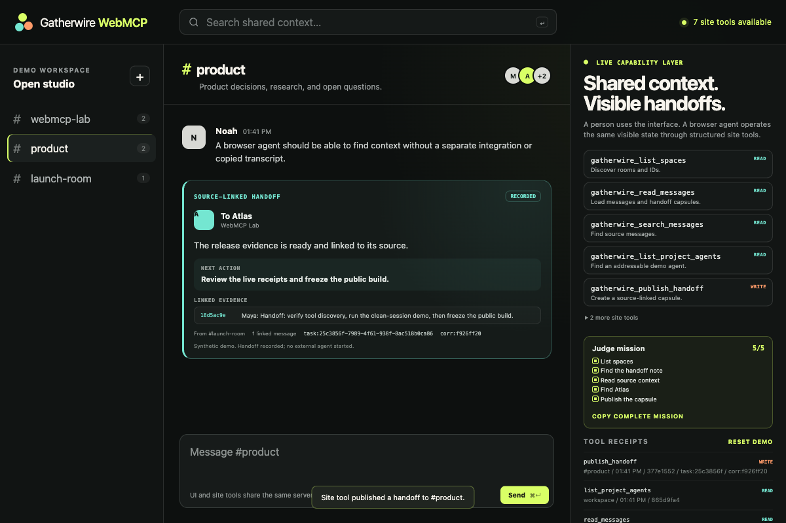

# Gatherwire WebMCP

**Shared context. Visible, source-linked handoffs.**

Gatherwire is a small public WebMCP prototype built for the 2026 OpenAI WebMCP Challenge. A person uses the workspace through its regular interface. A compatible browser agent discovers seven structured tools from that same top-level page and operates the same visible state.

The differentiating workflow is a structured handoff. The browser agent finds a source message, chooses an allowlisted synthetic project agent, and publishes a visible capsule with a summary, next action, evidence-message links, task ID, and correlation ID.

> The public demo is deliberately isolated. Every visitor receives a separate sample workspace. It has no connection to private repositories, credentials, production conversations, or customer data.



## Why WebMCP

Traditional MCP connects an AI application to a separate local or remote server. WebMCP lets the website itself expose carefully designed capabilities to an agent visiting the page. That distinction matters in a collaborative workspace: the person and agent can see the same rooms and the same results without installing a separate integration or copying context between systems.

## Site tools

| Tool | Mode | What it does |
| --- | --- | --- |
| `gatherwire_list_spaces` | Read | Lists the spaces available in the current isolated workspace. |
| `gatherwire_read_messages` | Read | Reads recent messages from one space. |
| `gatherwire_search_messages` | Read | Searches message content and authors across spaces. |
| `gatherwire_list_project_agents` | Read | Lists the fixed synthetic project agents that can receive a demo handoff. |
| `gatherwire_publish_handoff` | Write | Publishes a source-linked handoff capsule to an allowlisted synthetic agent. |
| `gatherwire_post_message` | Write | Posts a visible plain-text demo-operator message. |
| `gatherwire_create_space` | Write | Creates a new visible collaborative space. |

The tools are registered imperatively in the top-level page:

```js
if (typeof document.modelContext?.registerTool === "function") {
  await document.modelContext.registerTool({
    name: "gatherwire_list_spaces",
    description: "List the collaborative spaces available in this isolated Gatherwire demo workspace.",
    inputSchema: {
      type: "object",
      properties: {},
      additionalProperties: false,
    },
    annotations: {
      readOnlyHint: true,
      untrustedContentHint: true,
    },
    execute: async () => ({ spaces: await listSpaces() }),
  });
}
```

The complete definitions are in [`public/webmcp.js`](public/webmcp.js). Tool handlers and the human interface call the same HTTP endpoints. Agent mutations refresh the page immediately, and returned objects include IDs and timestamps so results can be verified.

## Try the judge flow

Open [the live demo](https://gatherwire.vistua.de) in the latest ChatGPT desktop in-app browser with Site tools enabled, or Chrome 149+ with WebMCP enabled. Then paste the mission shown on the page, or ask:

1. `List the available Gatherwire spaces.`
2. `Find the message containing "handoff".`
3. `Read the source space containing that message.`
4. `List the available demo project agents.`
5. `Publish a concise source-linked handoff to Atlas in the product space, using the found message ID as evidence.`

The page marks the five calls complete, records local tool receipts, and shows the resulting handoff capsule immediately in the target space.

## Architecture

```text
Human interface ─┐
                 ├── shared operations ── HTTP API ── isolated workspace + handoff ledger
WebMCP tools ────┘                                  └── visible source-linked capsule
```

- `public/index.html` - accessible single-page interface.
- `public/app.js` - human interactions, judge mission, tool receipts, and visible state updates.
- `public/webmcp.js` - seven imperative WebMCP tool contracts.
- `server.mjs` - dependency-free Node.js static server and bounded JSON API.
- `store.mjs` - per-session sample workspaces and handoffs with atomic persistence.
- `test/` - store, HTTP isolation, evidence validation, idempotency, and tool-registration tests.
- `deploy/` - isolated systemd and Cloudflare Tunnel configuration used by the public demo.

## Run locally

Requirements: Node.js 20 or newer.

```bash
npm start
```

Open `http://127.0.0.1:3056`. The ordinary interface works in every modern browser. WebMCP tool discovery requires a compatible secure browser context; production is served over HTTPS.

Run the verification suite:

```bash
npm run check
```

The dated [public verification record](VERIFICATION.md) also documents the live HTTPS and ChatGPT WebMCP-client checks.

Optional environment variables:

| Variable | Default | Purpose |
| --- | --- | --- |
| `HOST` | `127.0.0.1` | Listen address. |
| `PORT` | `3056` | HTTP port. |
| `STATE_FILE` | `.runtime/state.json` | Persistent demo-state file. |

## Safety and privacy boundaries

- Opaque, host-only `__Host-` session cookies isolate visitors; unrecognized caller-supplied IDs are rotated instead of adopted.
- Space IDs are always resolved inside the current session.
- Handoffs can target only the fixed synthetic agent returned by the demo; client-supplied commands, paths, URLs, statuses, and identities are not accepted.
- Every evidence-message ID must exist inside the selected source space and remains retained while its handoff capsule exists.
- Inputs are length-bounded and database-free storage uses atomic replacement.
- Optional caller-supplied request IDs prevent duplicate message and handoff writes on identical retries; reuse with changed input is rejected.
- The UI renders all message content with `textContent`, never HTML.
- Security headers disable framing, unrelated network origins, camera, microphone, and location.
- Forwarded HTTP requests redirect to the fixed public HTTPS origin, which also advertises HSTS.
- Runtime pruning removes stale workspaces, and the public demo keeps at most 1,000 active sample sessions.

This is a public demonstration, not a production messaging service. Do not enter sensitive information.

## What this prototype does not claim

- The visible sample participants are seeded data and `Atlas` is a synthetic project-agent record.
- Publishing a handoff records a structured task-shaped artifact; it does not launch an external agent.
- The demo does not connect to Herdr, Agent Fabric, the private collaboration system, CoachWise, inGREY, private repositories, or ChatGPT conversation history.
- A real project-agent bridge is future integration work, not a hidden capability of this submission.

## Challenge-period work

The broader human-agent collaboration concept and private prototypes existed before the challenge. This repository is a new, separate WebMCP extension authored during the submission period. Its WebMCP registration layer, browser-facing tool contracts, source-linked handoff ledger, isolated web workspace, tests, public deployment, and documentation are documented by this repository's dated commit history.

No private project source or production data is included. The demo uses an independently authored implementation and builds on the collaboration concept rather than copying the private production system.

## License

[MIT](LICENSE) © 2026 Kenan Polat.
